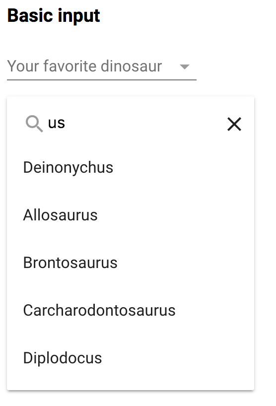

# paper-dropdown-input
A paper-input that provides the user with input suggestions

_[Demo and API Docs](https://juravenator.github.io/paper-dropdown-input/components/paper-dropdown-input/)_

## Examples

### Basic input

<!---
```
<custom-element-demo>
  <template>
    <script src="../webcomponentsjs/webcomponents-lite.js"></script>
    <link rel="import" href="paper-dropdown-input.html">
    <link rel="import" href="../paper-item/paper-item.html">
    <next-code-block></next-code-block>
  </template>
</custom-element-demo>
```
-->
```html
    <paper-dropdown-input label="Your favorite dinosaur" items='["Velociraptor","Deinonychus","Allosaurus","Brontosaurus","Carcharodontosaurus","Diplodocus","T-Rex"]'></paper-dropdown-input>
    <p style="height: 450px"></p>
```


### Custom template

`complexItems` is an array of objects of the form:
```json
{
  "value": "Deinonychus",
  "type": "carnivore"
}
```
```html
<paper-dropdown-input fancy label="Your favorite dinosaur" items='[[complexItems]]'>
  <template>
    <p disabled>Carnivores</p>
    <template is="dom-repeat" items="[[_getCarnivores(items)]]" as="item">
      <paper-item>[[item.value]]</paper-item>
    </template>
    <hr disabled>
    <p disabled>Herbivores</p>
    <template is="dom-repeat" items="[[_getHerbivores(items)]]" as="item">
      <paper-item>[[item.value]]</paper-item>
    </template>
  </template>
</paper-dropdown-input>
```


### Completely custom template

`complexItems` is an array of objects of the form:
```json
{
  "value": "Deinonychus",
  "avatar": "deinonychus.png",
  "type": "carnivore",
  "description": "Deinonychus is a genus of carnivorous dromaeosaurid coelurosaurian dinosaurs, with one described species, Deinonychus antirrhopus. This species, which could grow up to 3.4 metres (11 ft) long, lived during the early Cretaceous Period, about 115–108 million years ago (from the mid-Aptian to early Albian stages). Fossils have been recovered from the U.S. states of Montana, Utah, Wyoming, and Oklahoma, in rocks of the Cloverly Formation, Cedar Mountain Formation and Antlers Formation, though teeth that may belong to Deinonychus have been found much farther east in Maryland."
}
```
```html
    <paper-dropdown-input label="Your favorite dinosaur" items='[[complexItems]]'>
      <template>
        <template is="dom-repeat" items="[[items]]" as="item">
          <dinosaur-card data="[[item]]"></dinosaur-card>
        </template>
      </template>
    </paper-dropdown-input>
```


<!--  -->

## Styling
The items in the dropdown list reside in the light DOM, so you are free to style them however you like.

Additionaly, `paper-dropdown-input` implements the same styling as [`paper-dropdown-menu`](https://www.webcomponents.org/element/PolymerElements/paper-dropdown-menu/paper-dropdown-menu).
